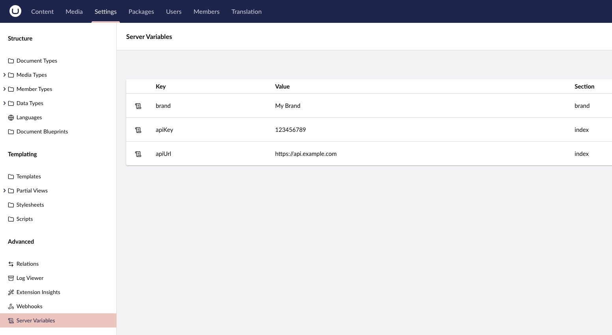

# Backoffice

This is how you can access the server variables in the backoffice.

## Workspace

The workspace in the Settings section is a good place to see all server variables:

## Usage

In any Backoffice component, you can now import the server variables where you need them by:

- [Importing the variables](./01-appsettings.md)
- [Global Context](./04-context.md)